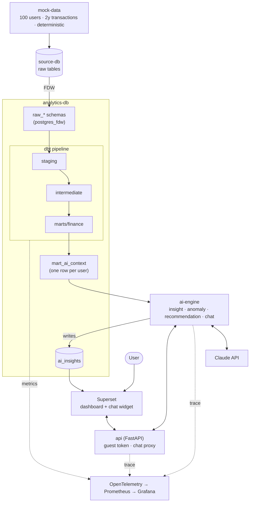

# Personal Finance Analytics: Multi-Source Data Platform with an AI Insight Engine

[](https://www.getdbt.com)
[](https://www.postgresql.org)
[](https://fastapi.tiangolo.com)
[](https://docs.anthropic.com)
[](https://superset.apache.org)
[](https://opentelemetry.io)

> An end-to-end analytics platform that turns the raw bank transactions, budgets, and investments of many users into clean analytical tables — then layers an autonomous AI engine on top that periodically reads those tables, generates grounded natural-language insights, and writes them back for users to explore in a dashboard. Built entirely on synthetic data.

---

## Vision & Mission

Most analytics portfolio projects are notebooks. They fail in three ways that matter in a real product:

- **No pipeline.** A one-off script transforms data once. There is no lineage, no tests, no layering — nothing that survives a schema change.
- **AI bolted on without grounding.** An LLM is wired directly to a prompt. It confabulates numbers because it never read the actual data.
- **No observability.** "The dashboard loads" is not an operability standard. When a nightly run fails silently, nobody knows.

This project is designed against each failure mode: a layered **dbt** pipeline with tests and lineage from raw source to mart, an **AI engine grounded on a versioned dbt mart** (`mart_ai_context`) rather than free-form prompts, and **OpenTelemetry tracing across every service** so a failed run is a visible event, not a surprise.

---

## Architecture & System Design

### System Topology



### What the user sees

Open Superset and you get:

- **This month's spend** — total, by category, and which budgets you blew past.
- **Net worth over 6 months** — the trend across accounts and investments.
- **Peer benchmark** — how you compare to users with a similar profile.
- **"Why did I spend so much this month?"** — typed into a chat box, answered by the AI engine using your own mart data as context.

### Architecture Decisions

| # | Decision | Why |
|---|---|---|
| 1 | **`postgres_fdw` to unify sources, not a copy job** | Real products keep a database per service. `analytics-db` mounts each source under `raw_*` schemas via FDW and reads them as if local — dbt connects to one database but draws from many. This mirrors the production pattern instead of flattening it into a single seeded DB. |
| 2 | **Layered dbt (staging → intermediate → marts) over ad-hoc SQL** | A layered model graph gives lineage, per-layer materialization, and tests at every boundary. `staging` is 1:1 rename/cast (view), `intermediate` holds business logic (ephemeral), `marts` are the dashboard-facing tables (table). A schema change breaks a test, not the dashboard. |
| 3 | **AI grounded on `mart_ai_context`, not raw prompts** | The AI engine never sees raw rows. dbt pre-aggregates each user into a single context row; the engine renders that into a versioned Jinja prompt. Insights are reproducible and auditable because their input is a tested dbt model, not an ad-hoc query. |
| 4 | **AI engine as an isolated service with two trigger modes** | Insight generation runs *after* `dbt build` (pipeline-triggered); anomaly and recommendation runs are *scheduled*. Decoupling the AI service from both the pipeline and the API keeps each concern independently deployable and testable. |
| 5 | **Deterministic synthetic data** | The generator is seeded so `docker compose up` produces identical data every time. A portfolio demo that changes on every run is not a demo — reproducibility is a feature. |
| 6 | **OpenTelemetry across every service** | API, AI engine, and pipeline emit traces, logs, and metrics through an OTel collector to Grafana. A failed nightly run or a slow Claude call is an observable event with a trace, not a silent gap. |

---

## Tech Stack & Services

### Services (Docker Compose)

| Service | Image / Build | Role |
|---|---|---|
| `source-db` | `postgres:16` | Raw operational tables (users, accounts, transactions, budgets) |
| `analytics-db` | `postgres:16` | Analytical warehouse + `postgres_fdw` foreign schemas |
| `mock-data` | `mock-data/` | Deterministic synthetic data generator → `source-db` |
| `dbt` | `dbt/Dockerfile` | Transformation pipeline: sources → staging → intermediate → marts → ai_layer |
| `api` | `api/Dockerfile` | FastAPI — Superset guest token + chat proxy |
| `ai-engine` | `ai-engine/Dockerfile` | FastAPI — Claude calls, insight/anomaly/recommendation runners, chat |
| `superset` | Apache Superset | Dashboards, SQL Lab, embedded chat widget |
| `observability` | OTel Collector · Prometheus · Grafana | Cross-service traces, metrics, dashboards |

### Source Layout

```text
personal-finance-analytics/
├── mock-data/        generate.py · models/ · generators/   — synthetic data
├── source-db/        init/ (01-schema.sql · 02-seed-static.sql)
├── analytics-db/     init/ (01-schema.sql · 02-setup-fdw.sql)
├── dbt/              models/{sources,staging,intermediate,marts/{finance,ai_layer}}
│                     seeds/ · macros/ · tests/ · snapshots/ · exposures/
├── api/              src/{routers,services,repositories,schemas,core}
├── ai-engine/        src/{runners,routers,services,repositories,prompts,schemas,core}
├── superset/         superset_config.py · dashboards/
└── observability/    otel-collector/ · prometheus/ · grafana/
```

Data flow direction: `mock-data → source-db → (FDW) analytics-db → dbt → mart_ai_context → ai-engine → ai_insights → superset`

### Technology Choices

| Layer | Technology | Rationale |
|---|---|---|
| Transformation | dbt Core (postgres) | Layered models, lineage, tests, snapshots, exposures, `dbt docs` |
| Source unification | PostgreSQL + `postgres_fdw` | Multi-source warehouse without an ETL copy step |
| API | FastAPI | Async-native, OpenAPI docs, OTEL hooks |
| AI orchestration | FastAPI (`ai-engine`) | Isolated service; pipeline-triggered + scheduled runners |
| LLM | Claude API | Natural-language insights and chat grounded in mart data |
| Prompts | Jinja2 | Versioned, reviewable prompt templates |
| BI | Apache Superset | Dashboards + SQL Lab + embedded chat |
| Observability | OpenTelemetry · Prometheus · Grafana | LLM-native spans, metrics, cross-service correlation |
| Reproducibility | Docker Compose | Whole stack with one command |
| CI | GitHub Actions | `dbt build` + test on every push |

---

## Engineering Goals

**"How does the analytics layer read from multiple source databases?"**
`analytics-db` mounts each source under `raw_*` schemas via `postgres_fdw`. dbt connects to one database and reads many — no copy job, no drift.

**"How do you stop the AI from inventing numbers?"**
The engine never sees raw rows. It reads `mart_ai_context` — a tested dbt model with one pre-aggregated row per user — and renders it into a versioned Jinja prompt. The input is auditable.

**"When does the AI run?"**
Insight generation is triggered after `dbt build`. Anomaly detection runs weekly and recommendations monthly, on a schedule, in dedicated runners decoupled from the request path.

**"How do you keep the demo reproducible?"**
The synthetic data generator is seeded. Every `docker compose up` produces byte-identical data, so dashboards and insights are stable across runs.

**"How do you know a nightly pipeline run failed?"**
Every service emits OpenTelemetry traces and metrics to Grafana. A failed `dbt build` or a slow Claude call is a visible event with a trace, not a silent gap.

**"How do you prevent a bad model change from shipping?"**
GitHub Actions runs `dbt build` + tests on every push. A failing grain, uniqueness, or relationship test fails the build before it merges.

---

## Current Status

| Step | Scope | Status |
|---|---|---|
| **1** | Foundation — repo scaffold, service topology, docker-compose, Makefile | ✅ Done |
| **2** | Source layer — `source-db` schema + deterministic synthetic data generator | 🔄 In Progress |
| **3** | Warehouse — `analytics-db` + `postgres_fdw` foreign schemas | ⬜ Planned |
| **4** | dbt pipeline — sources → staging → intermediate → marts → `mart_ai_context` | ⬜ Planned |
| **5** | AI engine — context builder, Claude service, insight/anomaly/recommendation runners | ⬜ Planned |
| **6** | Serving — `api` (guest token + chat proxy) + Superset dashboards & chat widget | ⬜ Planned |
| **7** | Observability + CI — OTel→Grafana wiring, GitHub Actions `dbt build` gate | ⬜ Planned |

**Foundation complete:** full service skeleton across eight modules, layered dbt project config with per-layer materialization, FastAPI scaffolds for `api` and `ai-engine`, Jinja prompt templates, and a Docker Compose / Makefile entrypoint.

---

## Getting Started

**Prerequisites:** Docker Desktop, an `ANTHROPIC_API_KEY`

```bash
# 1. Clone and configure environment
git clone https://github.com/EceDalpolat/personal-finance-analytics.git
cd personal-finance-analytics
cp .env.example .env          # fill in ANTHROPIC_API_KEY and review defaults
```

```bash
# 2. Start the stack
make up                       # docker compose up -d --build
```

```bash
# 3. Generate data and run the pipeline
make mock                     # synthetic data → source-db
make dbt-build                # dbt seed → run → test
```

| Service | URL |
|---|---|
| Superset | http://localhost:8088 |
| API + OpenAPI docs | http://localhost:8000/docs |
| Grafana | http://localhost:3000 |

---

## License

Apache 2.0

---

*All data is 100% synthetic. This project contains no real financial data or customer information.*
